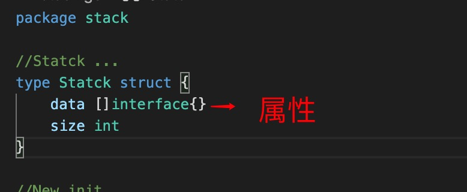
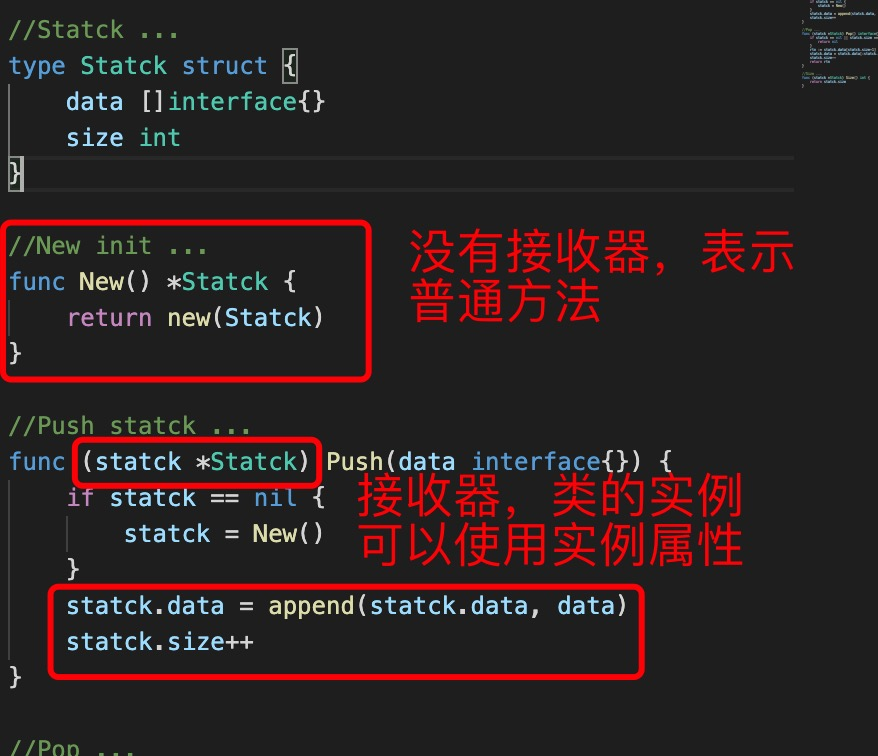
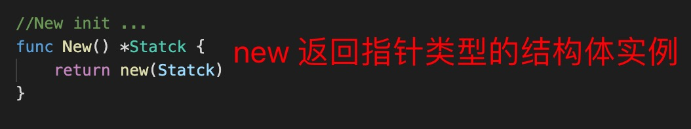
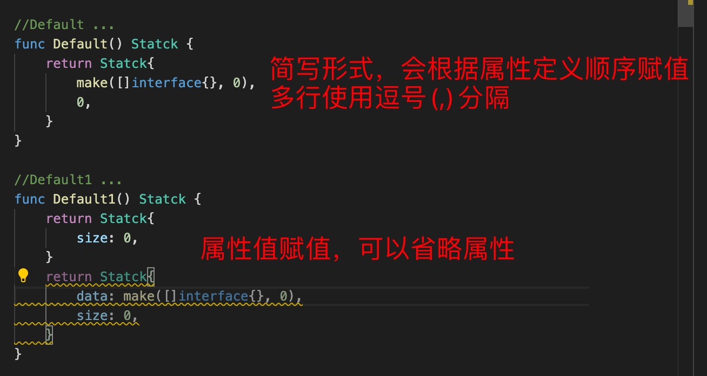
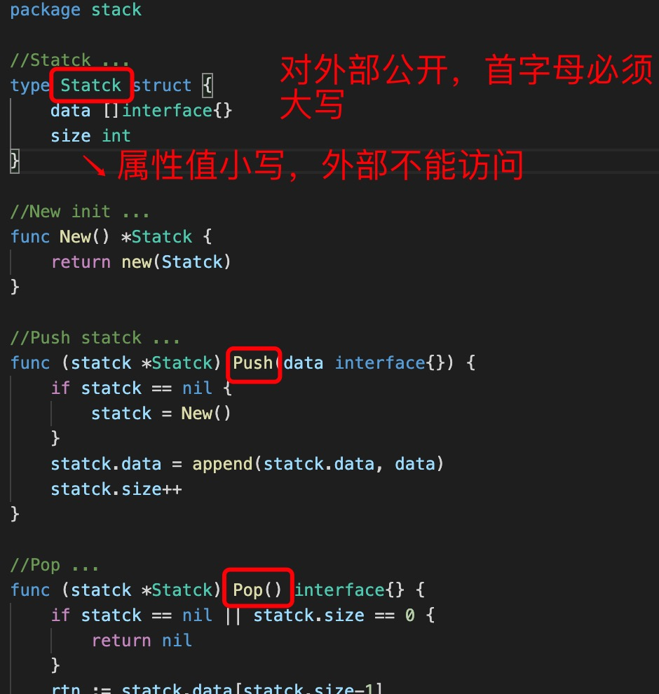
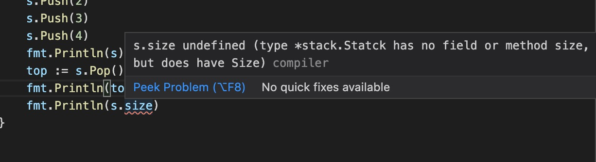

1. 结构体使用type struct 声明

   

2. 在go 语言中使用结构体代替class, 结构体中的方法有一个接受器，有接收器的方法表示类的实例方法

   

   >接收器有两种，一种是指针类型的接收器，一种是值类型的接收器，一般都是用指针类型的接收器 

   值类型的接收器当结构体中的数据量大时，会占用大量的内存，而指针类型的接收器只包含内存地址，

3. 结构体初始化

+ new: 生成类型的指针

    

+ 普通方法

    

4. 当结构体用于模块中时，要想外部能访问结构体和其中的属性，方法，则首字母必须大写

   

   如果属性未公开，那么外部不能访问结构的属性

   