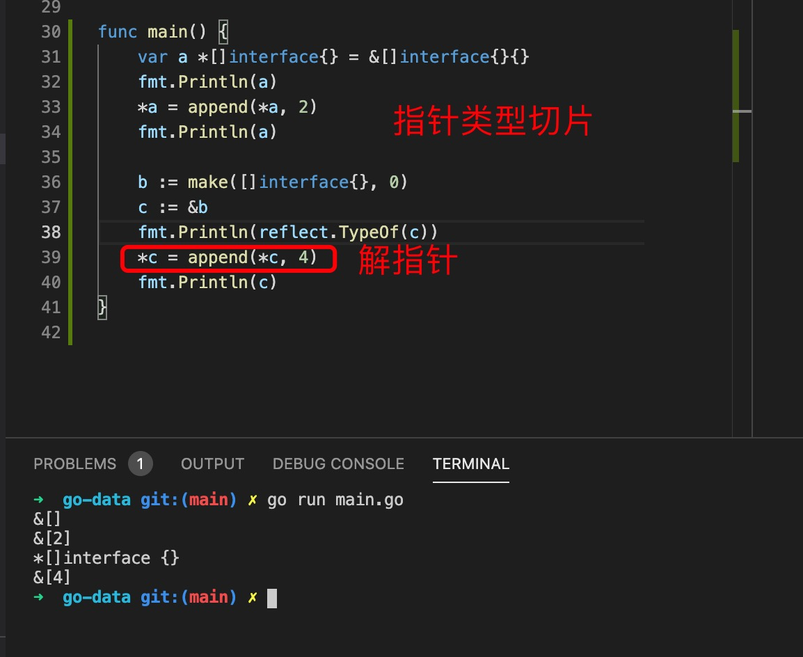

1. 在go 语言中使用interface{} 可以代表任意类型的值

2. interface{} 类型的变量都有一个(type) 类型声明推断

        x.(int) ==> 转成int 类型

        var a interface{} = 3
        var b int = a.(int)  // 强制转换成int 类型
        fmt.Println(reflect.TypeOf(b))

        fmt.Println(stack.peek().(string)) // 强制转换interface{} 类型为string

3. 指针类型切片

   

        