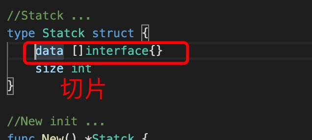

1. 在go 语言中切片是引用类型，传递的是地址

2. 在 go 中，数组长度是在编译期长度就固定的而且数组长度不可以改变， 切片可以看做动态类型的数组，可以动态增加数组的长度

   

3. 切片初始化

+ make(type,len,cap): make 仅用于slice,map,channel 

    
    此时len=cap =0

        make([]int,2,5)// len 长度为2,cap 为5

        a := make([]int, 0)
        // 设置了长度，则元素默认该类型的默认值
        b := make([]int, 2, 3)
        fmt.Println(a) //[]
        fmt.Println(b) //[0 0]

+ 普通赋值

        c := []int{}
        d := []int{0, 0}
        fmt.Println(c) //[]
        fmt.Println(d) //[0 0]

4. 切片没有截取删除等方法，只能在截取,

+ 去除末尾元素

        // 使用切片截取[:statck.size-1]
        statck.data = statck.data[:statck.size-1]

+ 删除第二个元素

    
    