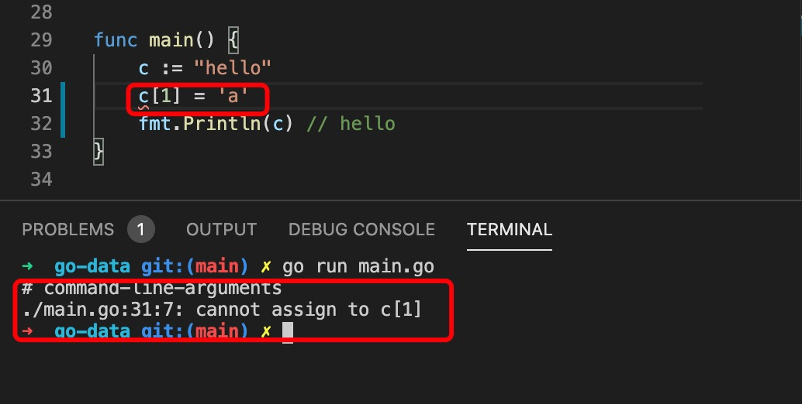

1. go 语言中string 使用双引号或者反引号`` 括起来，单引号表示字符

2. 字符使用单引号括起来，使用byte 或 rune 类型表示

   rune 类型支持中文字符

        c := "hello"
        a := c[1]
        fmt.Println(a) //101,返回assii 码值

3. 要输出字符串的单个字符需要使用string 强类型转换

        c := "hello"
        a := c[1]
        fmt.Println(string(a)) //e

4. string 是一种特殊的切片类型，使用[]byte 和 []rune 类型表示

        c := "hello"
        a := []byte(c)
        fmt.Println(a) //[104 101 108 108 111]

        c := "hello"
        a := []rune(c)
        fmt.Println(a) //[104 101 108 108 111]

        c := "hello"
        a := []rune(c)
        d := string(a) // []rune 或[]byte 类型转成字符串
        fmt.Println(d)// hello

5. 在 Go 语言中，字符串的内容是不能修改的，也就是说，***你不能用 s[0] 这种方式修改字符串中的 UTF-8 编码***，如果你一定要修改，那么你可以将字符串的内容复制到一个可写的缓冲区中，然后再进行修改。这样的缓冲区一般是 []byte 或 []rune。如果要对字符串中的字节进行修改，则转换为 []byte 格式，如果要对字符串中的字符进行修改，则转换为 []rune 格式，转换过程会自动复制数据。

   

        func main() {
            s := "Hello 世界！"
            r := []rune(s) // 转换为 []rune，自动复制数据

            r[6] = '中' // 修改 []rune

            r[7] = '国' // 修改 []rune

            fmt.Println(s) // s 不能被修改，内容保持不变, "Hello 世界！"

            fmt.Println(string(r)) // 转换为字符串，又一次复制数据 "Hello 中国！"
        }