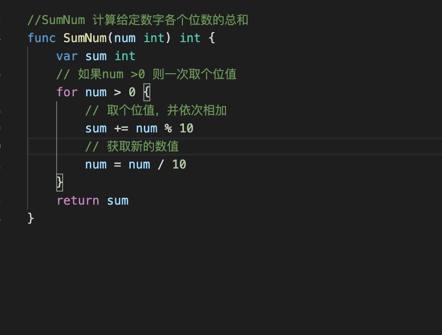
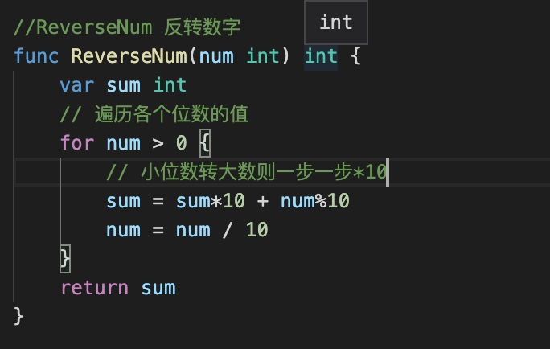

1. 数字分个位数，十位数，百位数，千位数等，相差10倍

2. 算法1，给定一个数字，算出各个位数的总和

   算法解析：

   获取个位数： num%10 ,然后num/10 ，然后获取新的个位数一次类推

   比如123： 首先获取个位数，123%10==3， 然后获取新的数字 123/10=12

   12 在获取新的个位数 12%10==2， 然后获取新的数字 12/10=1

   新的数字1,获取新的个位数1， 新的数字1/10=0,终止

   

3. 算法2，给定一个数字然后反转

   思路和算法1差不多

   