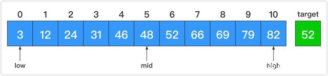
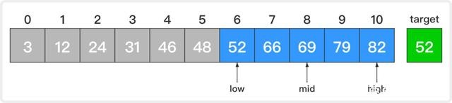
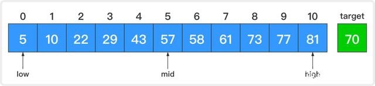
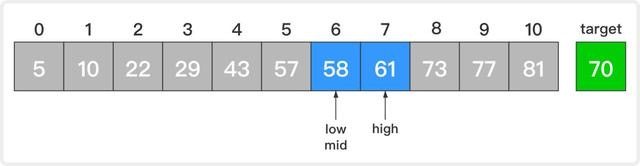
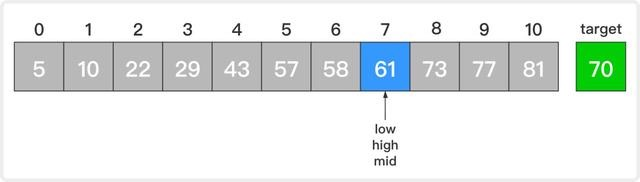
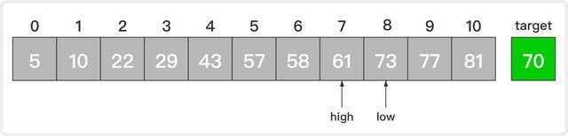
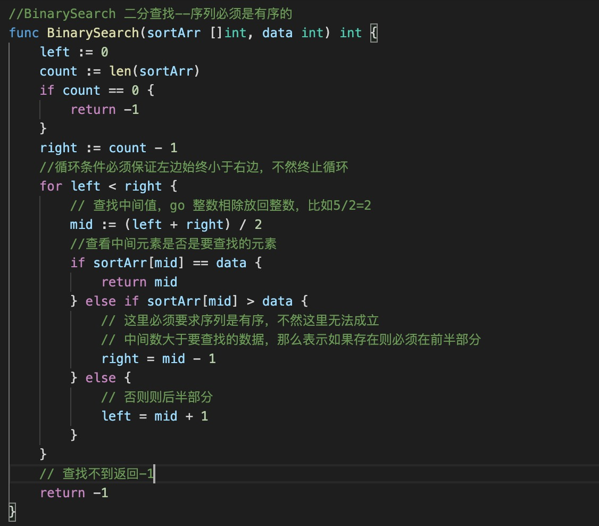

1. 二分查找是一种非常快速的查找算法，二分查找又叫折半查找

   它对要查找的序列有两个要求：

   + 该序列必须是有序的（即该序列中的所有元素都是按照大小关系排好序的，升序和降序都可以）

   + 该序列必须是顺序存储的

2. 算法原理

+ 1.如果待查序列为空，那么就返回-1，并退出算法；这表示查找不到目标元素。

+  2.如果待查序列不为空，则将它的中间元素与要查找的目标元素进行匹配，看它们是否相等。

+ 3.如果相等，则返回该中间元素的索引，并退出算法；此时就查找成功了。

+ 4.如果不相等，就再比较这两个元素的大小。

+ 5.如果该中间元素大于目标元素，那么就将当前序列的前半部分作为新的待查序列；这是因为后半部分的所有元素都大于目标元素，它们全都被排除了。

+ 6.如果该中间元素小于目标元素，那么就将当前序列的后半部分作为新的待查序列；这是因为前半部分的所有元素都小于目标元素，它们全都被排除了。

+ 7.在新的待查序列上重新开始第1步的工作。

   二分查找之所以快速，是因为它在匹配不成功的时候，每次都能排除剩余元素中一半的元素。因此可能包含目标元素的有效范围就收缩得很快，而不像顺序查找那样，每次仅能排除一个元素

   >但是要求序列必须为排序好的，不然第5步和第六步就不成立了。

3. 实例解析

   >3.1 查找成功的情况

   假设原始序列为array=[3, 12, 24, 31, 46, 48, 52, 66, 69, 79, 82]，目标元素target=52。

   1. 开始时，low=0，high=10，mid=(low + high) / 2 = 5。

   

    比较中间元素和目标元素，48小于52。这说明若目标元素存在，则它必定在原序列的后半部分。让low=mid + 1 = 6而high不变，这样low和high就指向了原序列的后半部分。

   2. 此时，low=6，high=10，mid=(low + high) / 2 = 8。

   

   同样的，比较新的中间元素和目标元素，69大于52。这说明若目标元素存在，它必定在当前待查序列的前半部分。让high=mid - 1 = 7而low不变，这样low和high就指向当前待查序列的前半部分。

   3. 此时，low=6，high=7，mid=(low + high) / 2 = 6

   

   比较新的中间元素和目标元素，52等于52。查找成功，返回该中间元素的索引6并退出算法。

   > 3.2 查找不到的情况

   假设原始序列为array=[5, 10, 22, 29, 43, 57, 58, 61, 73, 77, 81]，目标元素target=70。

   1. 开始时，low=0，high=10，mid=(low + high) / 2 = 5；

   

   比较中间元素和目标元素，57小于70。这说明若目标元素存在，那么它一定在原序列的后半部分。让low=mid + 1 = 6而high不变，这样low和high就指向原序列的后半部分。

   2. 此时，low=6，high=10，mid=(low + high) / 2 = 8；

    

   比较新的中间元素和目标元素，73大于70。这说明若目标元素存在，那么它一定在当前待查序列的前半部分。让high=mid - 1 = 7而low不变，这样low和high就指向当前待查序列的前半部分

   3. 此时，low=6，high=7，mid=(low + high) / 2 = 6；

   

   比较新的中间元素和目标元素，58小于70。这说明若目标元素存在，那么它一定在当前待查序列的后半部分。让low=mid + 1 = 7而high不变，这样low和high就指向当前待查序列的后半部分。

   4. 此时，low=7，high=7，mid=(low + high) / 2 = 7；

   

   比较新的中间元素和目标元素，61小于70。这说明若目标元素存在，那么它一定在当前待查序列的后半部分。让low=mid + 1 = 8而high不变

   5. 此时，low=8，high=7，low大于high说明待查序列已为空，也就说明查找不到目标元素。此时，返回-1并退出算法，表示查找不成功

   

4. 代码实现

   