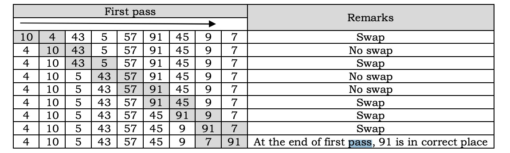
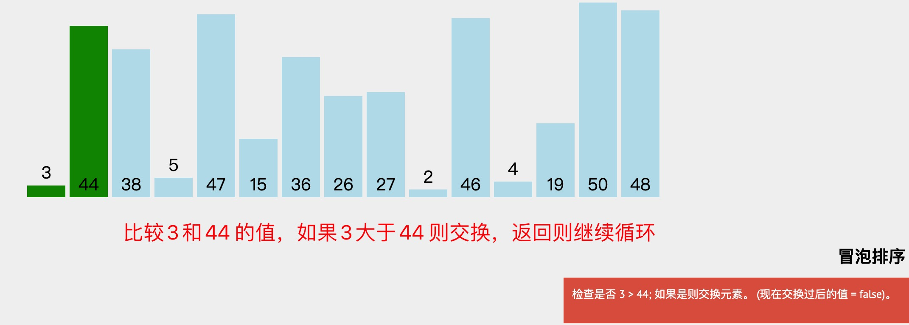
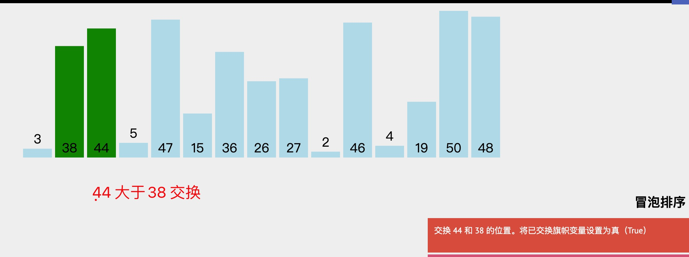
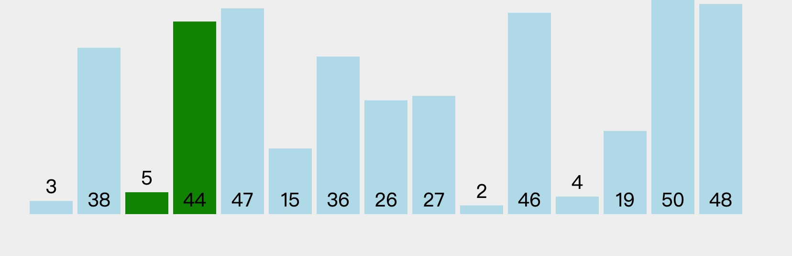
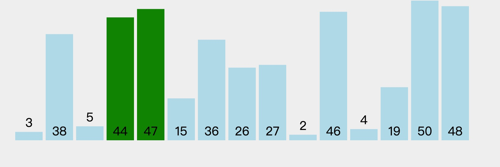
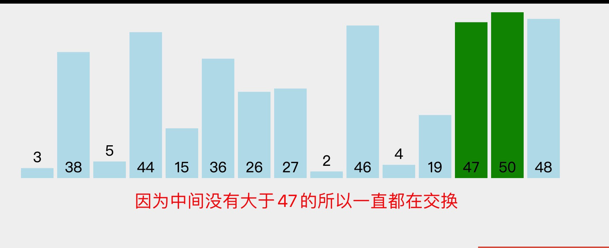
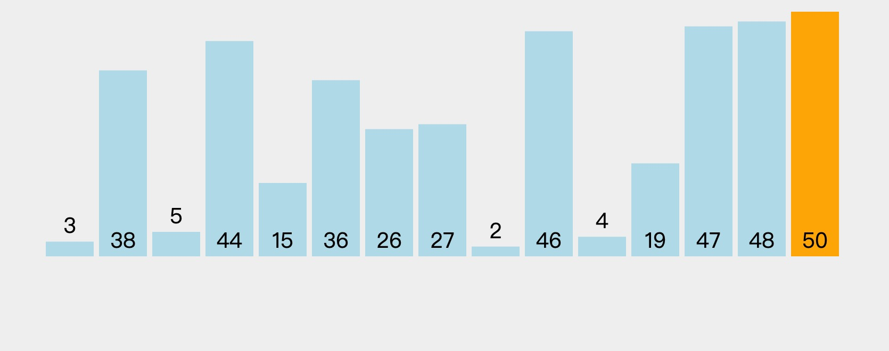
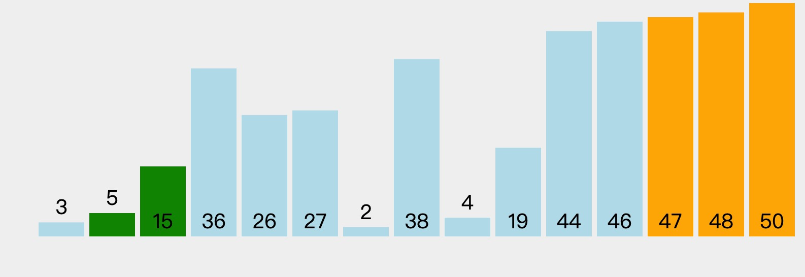

1. 冒泡排序

   冒泡排序就是把小的元素往前调或者把大的元素往后调。比较是相邻的两个元素比较，交换也发生在这两个元素之间。所以，如果两个元素相等，是不会再交换的

        func BubbleSort(arr []int) []int {
            l := len(arr)
            // 最后一个不需要再比较
            for i := 0; i < l-1; i++ {
                // 这里减i 是因为每次循环完毕，后面已经拍好序，因此不需要再排序，-1 是因为下面判断的时候用到了j+1 ，因此要减一，最后一个不需要
                for j := 0; j < l-i-1; j++ {
                    // 把大的元素向后移动
                    // 
                    if arr[j] > arr[j+1] {
                        arr[j], arr[j+1] = arr[j+1], arr[j]
                    }
                }
            }
            return arr
        }

        思路就是：第一次把最大的放到最右边，然后循环一次找出最大的

   

   第一次外层循环，找到最大值91，然后外层循环开启，第二次找到最大值57,直到循环完毕，返回排序号的序列

2. 实现原理

    
    因为3小于44 ,因此不做任何操作，接着循环j=1,开始比较44和38 ，因为44 大于38因此交换两个数据的位置

    

    然后比较44 和5，交换

    
    然后44和47 比较，44 小于47，不做任何操作
    
    然后继续循环
    
    47 和50 相比，50大于47，因此不发生交换，
    50 和48 比较，50大于48 两者交换
    
    第一轮循环完毕，开启下一轮排序，***因为最后一个已经不用排序，所以j 为len-i-1***

    