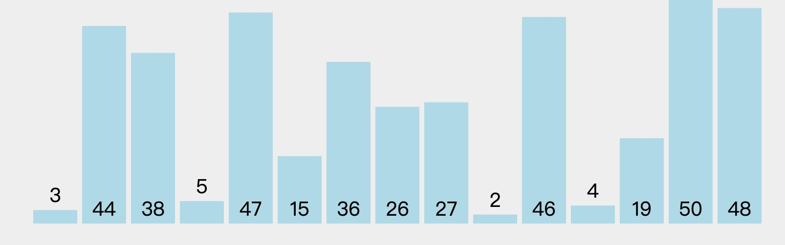
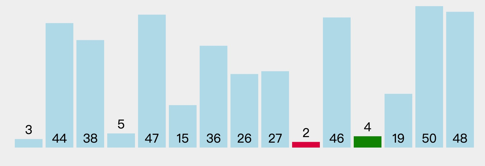
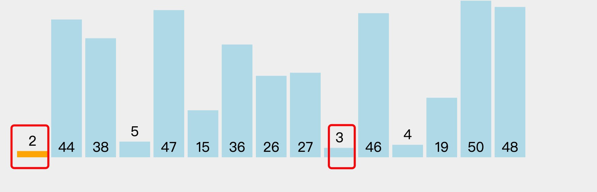
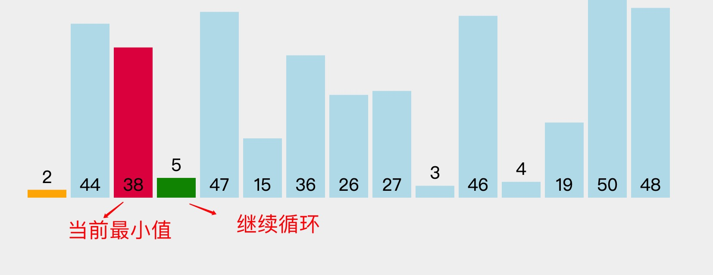
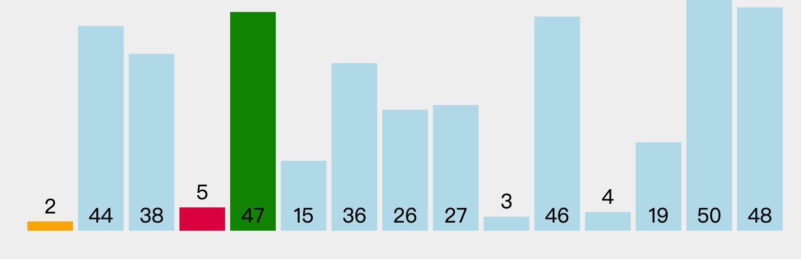
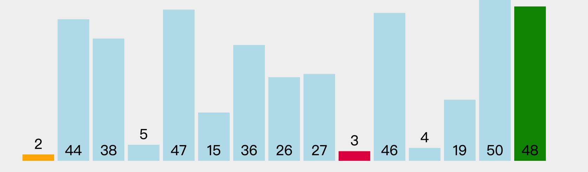
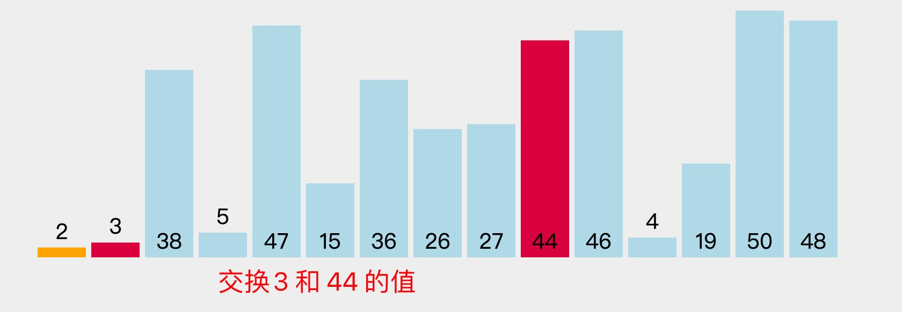
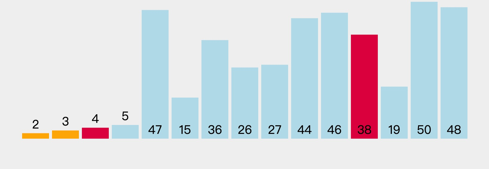
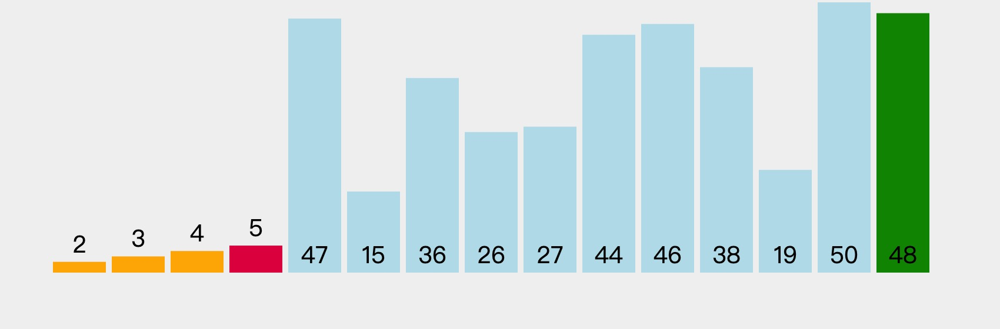
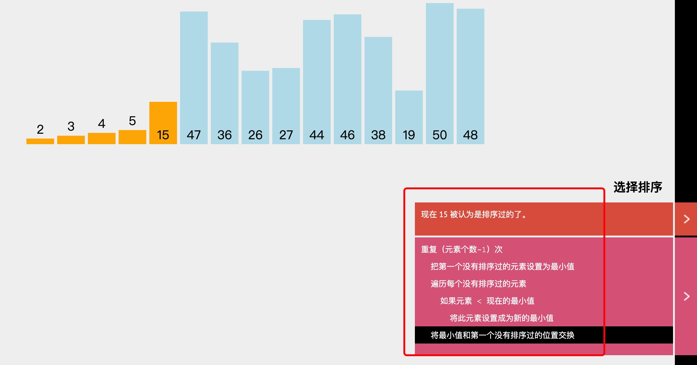

1. 选择排序

   

   首先开始默认以3位最小元素，然后循环后面的元素，找到比三小的元素，在此实例中比3 小的为2，此时记录最小元素所在的索引index, 那么此时最小的元素为2，

   

   然后接着循环后面的数据，是否还有比2 小的数据，直到循环结束。 在此实例中没有比2 小的，因此最小的为2， 交换2和3 

   

   开启第二次循环，把44 设为最小值，循环后面的数据，比较，首先碰到38 比44小，则把最小值设置为38，并记录38 的索引为最小索引，然后继续循环查找比38小的元素

   

   5比38 小，此时设置最小值为5，然后记录最小值

   

   47到27 都比5大，不做任何操作，然后遇到3 ,设置3 为最小值，

   

   一直到循环结束，没有比3 小的，那么交换44 和 3 的值

   

   然后按照上面步骤依次类推

   

   5 没有比5 小的，因此循环结束后不需要做任何操作

   

   

2. 代码实现

        //SelectSort 选择排序
        func SelectSort(arr []int) []int {
            l := len(arr)
            // 当到最后一个时，差不多已排好序，不需要再比因此为l-1
            for i := 0; i < l-1; i++ {
                // 默认为第一个元素为最小值
                minIndex := i
                // 遍历循环下面的所有元素到最后
                for j := i + 1; j < l; j++ {
                    // 找到所有元素中最小的一个值
                    if arr[minIndex] > arr[j] {
                        // 记录最小值的索引
                        minIndex = j
                    }
                }
                if i != minIndex {
                    // 交换两个元素的值
                    arr[i], arr[minIndex] = arr[minIndex], arr[i]
                }

            }
            return arr
        }