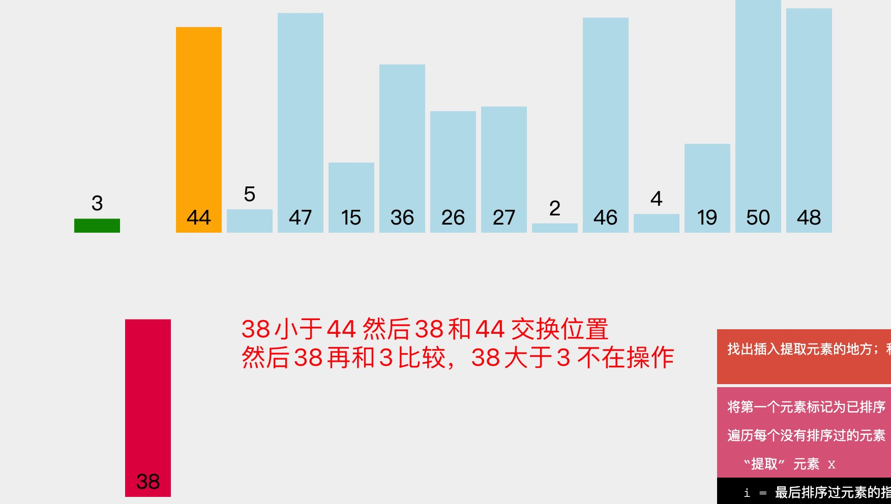

1. 插入排序

   默认把第一个元素当做已排序好的元素，从第一个位置开始，和已排序好的元素一次比较，如果元素小于已排好的元素，则交换位置，然后继续和已排好的元素比较

   

   默认把3 当做已排序好的元素，从44 开始，44 大于3，不做任何操作

   开始比较38，
   
   
   

   比较5 ，5 先和44 比较，5小于44则交换位置，然后5在
   

   然后5在和38比较，5小于38 则和38 交换位置
   

   然后5 和 3 在比较，5大于3 则不在做操作

   

   然后后面依次类推

2. 代码实现

   

