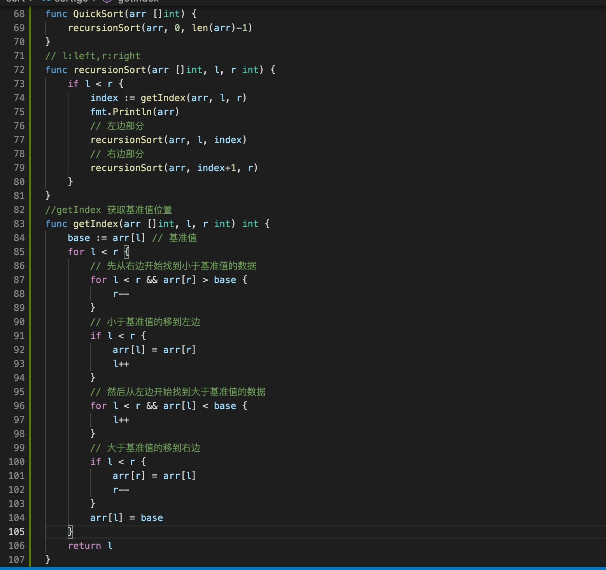

1. 快速排序找到一个基准值，然后把比基准值小的数据放到左边，把数据比基准值大的放到右边，然后用分治法分别排序左边和右边

   默认以第一个元素为基准值，然后左右两指针遍历元素，把小于基准值的元素放到左边，把大于基准值的放到右边

        arr := []int{72, 6, 57, 88, 60, 42, 83, 73, 48, 85}
    第一次以72 为基准值，先从右边开始查找，85大于72，则右边指针先左移动，48 小于72 ，那么把48 移动到左边

        arr[l]=arr[r] // 此时r 执行右边的48 
        l++ // 移动左边指针
        {48, 6, 57, 88, 60, 42, 83, 73, 48, 85}
    
    开始移动左边指针，一值找到大于base 72 的值

        // 然后从左边开始找到大于基准值的数据
		for l < r && arr[l] < base {
			l++
		}
		// 大于基准值的移到右边
		if l < r {
			arr[r] = arr[l]
			r--
		}
    88 大于72，那么把大的往右移动

            arr[r] = arr[l]
			r--
        // 此时l 指向57 后面的88
        // 右边开始减
        {48, 6, 57, 88, 60, 42, 83, 73, 88, 85}
    
    把基准值付给88所在的位置

        arr[l] = base
    
        {48, 6, 57, 72, 60, 42, 83, 73, 88, 85}

    此时l<r 因此继续循环
    一致到42 小于72，

        {48, 6, 57, 42, 60, 42, 83, 73, 88, 85}
    开始移动左边，60小于72，继续移动此时l==r 终止循环

        arr[l] = base
    
        [48 6 57 42 60 72 83 73 88 85]
    
    返回index 值

    然后分半

    先排序左边

        // 已42 为基准，小于42 的放到左边，大于42放到右边
        [42 6 48 57 60 72 83 73 88 85]
        // 分半继续以42位基准
        [6 42 48 57 60 72 83 73 88 85]
         // 分半继续以48位基准
        [6 42 48 57 60 72 83 73 88 85]
        // 分半继续以57位基准
        [6 42 48 57 60 72 83 73 88 85]
        // 分半继续以60位基准
        [6 42 48 57 60 72 83 73 88 85]

        左边排序完毕
    
        
    然后排序右边

        // 以83 为基准
        [6 42 48 57 60 72 83 73 88 85]
        // 以73位记住
        [6 42 48 57 60 72 73 83 88 85]
        // 以88 为基准
        [6 42 48 57 60 72 73 83 88 85]
        // 以85 为基准
        [6 42 48 57 60 72 73 83 85 88]
        // 最后结果
        [6 42 48 57 60 72 73 83 85 88]

2. 代码实现

   