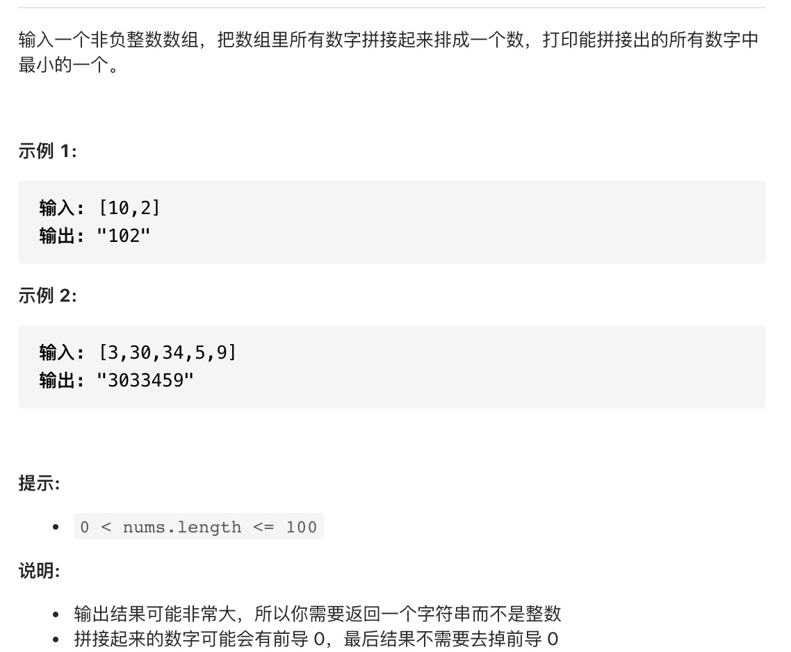

1. 把数组排成最小的数

   

   难点： 自对应排序规则，不在是简单的两个数比较大小

   解题思路：

   + 因为给定的数不定，组合成的数可能超过int 的最大值,因此使用字符串表示

            // int 型切片转成字符串类型切片
            func convert(arr []int) []string {
                rtn := make([]string, 0)
                for _, value := range arr {
                    rtn = append(rtn, strconv.Itoa(value))
                }
                return rtn
            }
    
    + 排序

       如果x+y>y+x ，那么x>y, 比如3和30, 

       x=3

       y=30

       x+y =330

       y+x=303

       那么3>30

            // 冒泡排序
            func sort(arr []string) []string {
                l := len(arr)
                for i := 0; i < l; i++ {
                    for j := 0; j < l-i-1; j++ {
                        if arr[j]+arr[j+1] > arr[j+1]+arr[j] {
                            arr[j], arr[j+1] = arr[j+1], arr[j]
                        }
                    }
                }
                return arr
            }
    
    + 结果转成字符串

            func minNumber(nums []int) string {
                b := convert(nums)
                fmt.Println(len(b))
                b = sort(b)
                // 切片转成字符串
                return strings.Join(b,"")
            }