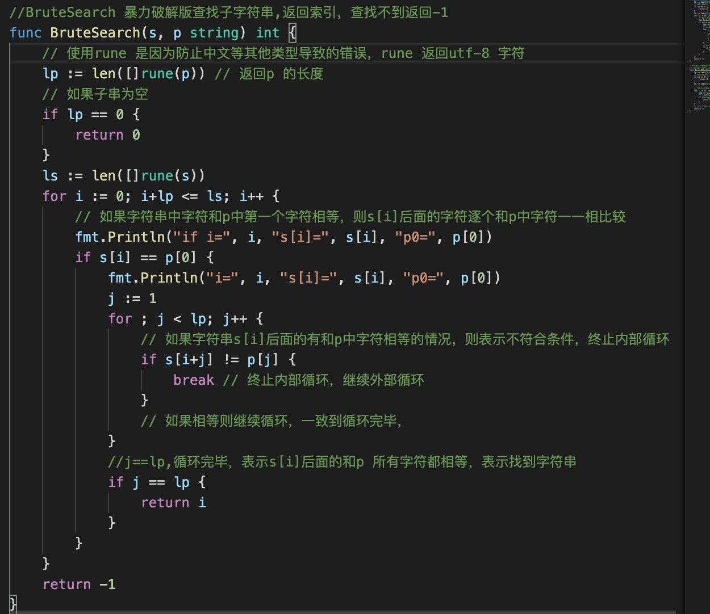
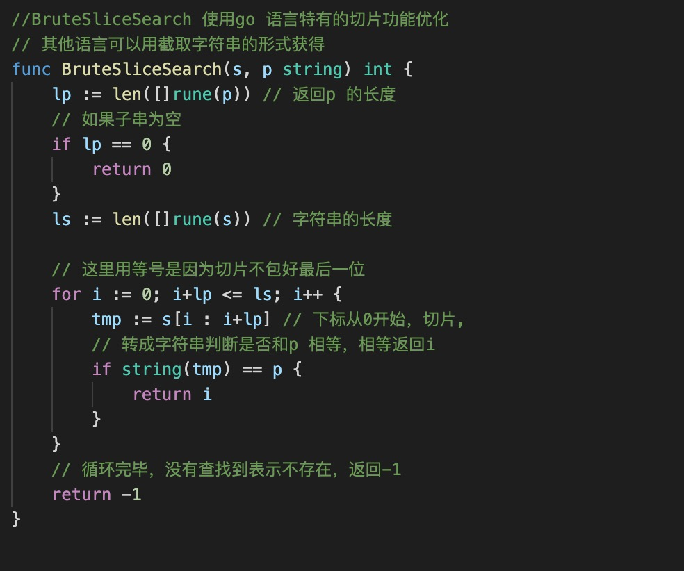

1. 查找子字符串首次出现在字符串中的位置

   > 解法1： 使用go 语言中string库中自带的方法

        t := "hello word"
        p := "word"
        // strings 自带的index, 返回子字符串在字符串首次出现的位置，存在返回索引，不存在返回-1
        z := strings.Index(t, p）
    
   > 暴力解法

      遍历字符串，首先查找和子字符串第一个字符相等的字符，然后开始遍历字符串，一个一个和字符串中的字符串匹配是否相等

      

   >  利用go 语言中的切片功能省去内部循环，也可以使用其他语言的截取功能

      